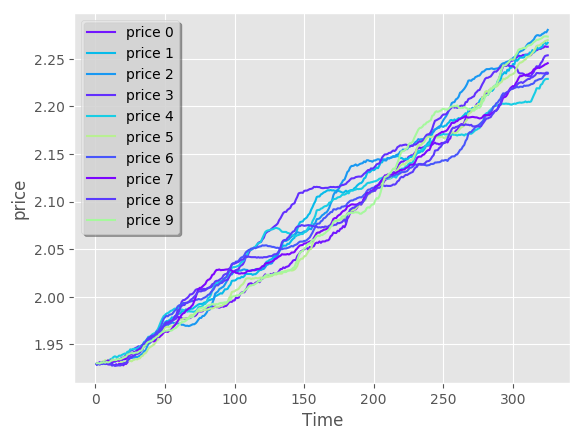
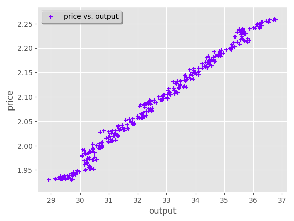
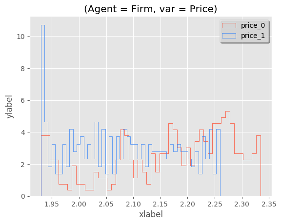

Folder structure
====

There are several scripts, located in folder ``src/visualisation_scripts`` that deal with different steps during the data visualisation/transformation processes:

- ``main.py`` : Contains code to read in the input data and primary config files, filter the data based on necessary conditions, and link the different Summary, Plot, and Transformation modules.
- ``summarystats.py`` : Takes in a Pandas dataframe, and computes the necessary summary as needed, and outputs the result as a Pandas dataframe.
- ``plots.py``: Takes in a Pandas dataframe, and returns the necessary plots as specified.
- ``transform.py`` : Takes in a Pandas dataframe, and returns/ writes to a file the necessary transformations.
- ``parameters.py`` : Contains code for main configuration and reads in config files.

The config files are contained in the folder named ``src/visualisation_scripts/config``. It contains three configuration files:

- ``config.yaml`` : define i/o path, plot-types, agents and appropriate variables, filter options, desired summary
- ``plot_config.yaml`` : define plot properties i.e. name, legends, line style, fill etc.
- ``config_transform.yaml``: define variables to transform, type of data transformations, i/o info to store data in a file after transformations

Note: Further details on how to use the config (yaml) files can be found on the configuration file `config.rst` in this documentation.

Testing
=======

To run the module, use:

   $ python3 /src/visualisation_scripts/main.py -p config-path

where config-path is the path to the folder containing the yaml files (in this git repository's folder structure it is ``FLAViz/src/visualisation_scripts/config/``)

Note: The module has only been tested under Unix/ Unix-like systems. It has not been tested for Windows and therefore
there is no guarentee of proper execution for such systems.

Examples
========

Once the necessary parameters are set, by following the instructions specified in the configuration file `config.rst`, the module can be run to get the desired results. To demonstrate some of the functionalities,
the parameters of the configuration files are shown below, along with the plots they yield.

Using the test_data_, and the following config settings, the following plots can be produced.

.. _test_data: https://github.com/svdhoog/FLAViz/tree/master/data/visualisation

Timeseries
==========

**Example 1.1** (*For agent Firm, one set, ten runs, eighty instances, plotted in a single plot* ):

config.yaml::

    plot1:
        timeseries:
            agent: Firm
            analysis: multiple_run
            variables:
                var1: [price]
            set: [13]
            run: [range,[1,10]]
            major: [range,[6020,12500,20]]
            minor: [range,[1,80]]
            summary: mean

plot_config.yaml::

    plot1:
        number_plots: one
        plot_format: png
        plot_legend: yes
        legend_location: best
        xaxis_label: Time
        yaxis_label: price
        linestyle: solid
        marker: None

**Example 1.2** (*For agent Firm, one set, one run, quantile values of of distribution over eighty instances, plotted in a single plot* ):

config.yaml::

    plot2:
        timeseries:
            agent: Firm
            analysis: multiple_run
            variables:
                var1: [price]
            set: [10]
            run: [1]
            major: [range,[6020,12500,20]]
            minor: [range,[1,80]]
            summary: custom_quantile
            quantile_values:
               lower_percentile : 0.20
               upper_percentile : 0.80

plot_config.yaml::

    plot2:
        number_plots: one
        plot_format: png
        plot_legend: yes
        legend_location: best
        xaxis_label: Time
        yaxis_label: price
        linestyle: solid
        marker: None
        fill_between: yes
        fillcolor: red

.. image:: ./plots/one_set_multiple_runs_ts_quantile_0.png
   :height: 100px
   :width: 200 px
   :scale: 50 %
   :alt: alternate text
   :align: right

**Example 1.3** (*For agent Firm, four sets, twenty runs each, eighty instances, quantile values plotted in a single plot* ):

config.yaml::

    plot3:
        timeseries:
            agent: Firm
            analysis: multiple_batch
            variables:
                var1: [price]
            set: [10,13,16,17]
            run: [range,[1,20]]
            major: [range,[6020,12500,20]]
            minor: [range,[1,80]]
            summary: custom_quantile
            quantile_values:
                lower_percentile : 0.20
                upper_percentile : 0.80

plot_config.yaml::

    plot3:
        number_plots: one
        plot_legend: yes
        legend_location: best
        x-axis label: Time
        y-axis label: price
        linestyle: solid
        marker: None
        fill_between: yes
        fillcolor: darkgreen

.. image:: ./plots/ts_multibatch_analysis_0.png
   :height: 100px
   :width: 200 px
   :scale: 50 %
   :alt: alternate text
   :align: right

**Example 1.4** (*For agent Firm, one set, one run, twenty instances, timeseries plot of one variable* ):

config.yaml::

    plot4:
       timeseries:
           agent: Firm
           analysis: agent
           variables:
               var1: [price]
           set: [13]
           run: [1]
           major: [range,[6020,12500,20]]
           minor: [range,[1,20]]
           summary: mean

**Note:** In case where analysis: agent, the full set is plotted, so it is not necessary to specify summary. The distribution over agent-instances can be computed by calling multiple batch analysis, with a single set value and a single run value.

plot_config.yaml::

    plot4:
       number_plots: one
       plot_legend: no
       legend_location: best
       xaxis_label: Time
       yaxis_label: price
       linestyle: solid
       marker: None

.. image:: ./plots/one_set_one_run_agentanalysis_timeseries_price.png
   :height: 100px
   :width: 200 px
   :scale: 50 %
   :alt: alternate text
   :align: right

Boxplot
=======

**Example 2.1** (*For agent Firm, one set, one run, eighty instances, boxplot* ):

config.yaml::

    plot5:
        boxplot:
            agent: Firm
            analysis: multiple_set
            variables:
                var1: [price]
            set: [13]
            run: [1]
            major: [range,[6020,12500,20]]
            minor: [range,[1,80]]
            summary: full

plot_config.yaml::

    plot5:
        number_plots: one
        plot_legend: yes
        legend_label: (Agent = Firm, var = Price)
        legend_location: best
        xaxis_label: Time
        yaxis_label: Distribution over price
        number_bars: 5

.. image:: ./plots/one_set_one_run_bp_price_price.png
   :height: 100px
   :width: 200 px
   :scale: 50 %
   :alt: alternate text
   :align: right

Scatterplot
===========

**Example 3.1** (*For agent Firm, one set, twenty runs, averages of eighty instances, scatterplot of the ensemble of two variables* ):

config.yaml::

    plot6:
        scatterplot:
            agent: Firm
            analysis: multiple_batch
            variables:
                var1: [price]
                var2: [output]
            delay: no
            set: [13]
            run: [range,[1,20]]
            major: [range,[6020,12500,20]]
            minor: [range,[1,80]]
            summary: mean

plot_config.yaml::

    plot6:
        number_plots: one
        plot_legend: yes
        legend_location: best
        legend_label: price vs. output
        linestyle: solid
        marker: +

**Example 3.2** (*For agent Firm, one set, twenty runs, eighty instances, scatterplot for the agent level of one variable with delay* ):

config.yaml::

    plot7:
        scatterplot:
            agent: Firm
            analysis: agent
            variables:
                var1: [price]
            delay: yes
            set: [13]
            run: [range,[1,20]]
            major: [range,[6020,12500,20]]
            minor: [range,[1,80]]
            summary: full

plot_config.yaml::

    plot7:
        number_plots: one
        plot_legend: no
        legend_location: best
        legend_label: price delay vs. price
        marker: +

.. image:: ./plots/one_set_agent_sp_price_delay_0.png
   :height: 100px
   :width: 200 px
   :scale: 50 %
   :alt: alternate text
   :align: right

**Example 3.3** (*For agent Firm, one set, twenty runs each, eighty instances each, delay plot for one variable* ):

config.yaml::

    plot8:
        scatterplot:
            agent: Firm
            analysis: multiple_batch
            variables:
                var1: [price]
            delay: yes
            set: [13]
            run: [range,[1,20]]
            major: [range,[6020,12500,20]]
            minor: [range,[1,80]]
            summary: mean

plot_config.yaml::

    plot8:
        number_plots: one
        plot_legend: yes
        legend_location: best
        legend_label: price delay vs. price
        linestyle: solid
        marker: o

.. image:: ./plots/one_set_multiple_runs_sp_price_delay_0.png
   :height: 100px
   :width: 200 px
   :scale: 50 %
   :alt: alternate text
   :align: right

Histogram
=========

**Example 4.1** (*For agent Firm, one set, one run, eighty instances, histogram of population distribution of one variable* ):

config.yaml::

    plot9:
        histogram:
            agent: Firm
            analysis: multiple_run
            variables:
                var1: [price]
            set: [10]
            run: [1]
            major: [range,[6020,12500,20]]
            minor: [range,[1,80]]
            summary: mean

plot_config.yaml::

    plot9:
        number_plots: one
        plot_title: (Agent = Firm, var = Price)
        number_bins: 50
        histtype: bar
        plot_legend: yes
        fill_between: yes
        stacked: False
        legend_location: best
        xaxis_label: xlabel
        yaxis_label: ylabel

.. image:: ./plots/one_set_one_run_hg_price_price.png
   :height: 100px
   :width: 200 px
   :scale: 50 %
   :alt: alternate text
   :align: right

**Example 4.2** (*For agent Firm, one set, twenty runs, eighty instances, histogram of population distribution of one variable* ):

config.yaml::

    plot10:
        histogram:
            agent: Firm
            analysis: multiple_batch
            variables:
                var1: [price]
            set: [10]
            run: [range,[1,20]]
            major: [range,[6020,12500,20]]
            minor: [range,[1,80]]
            summary: mean    # Note: the summary is mean value, over each level, gives hist of distribution of means
plot_config.yaml::

    plot10:
        number_plots: one
        plot_title: (Agent = Firm, var = Price)
        number_bins: 50
        histtype: bar
        plot_legend: yes
        fill_between: yes
        stacked: False
        legend_location: best
        xaxis_label: xlabel
        yaxis_label: ylabel

.. image:: ./plots/fourpointthree.png
   :height: 100px
   :width: 200 px
   :scale: 50 %
   :alt: alternate text
   :align: right

**Example 4.3** (*For agent Firm, histogram of ensemble distribution of one variable across twenty runs* ):

config.yaml::

    plot11:
        histogram:
            agent: Firm
            analysis: multiple_batch
            variables:
                var1: [price]
            set: [10]
            run: [range,[1,20]]
            major: [range,[6020,12500,20]]
            minor: [range,[1,80]]
            summary: full  # Note: here the histogram is over the entire distribution

plot_config.yaml::

    plot11:
        number_plots: one
        plot_title: (Agent = Firm, var = Price)
        number_bins: 50
        histtype: bar
        plot_legend: yes
        fill_between: yes
        stacked: False
        legend_location: best
        xaxis_label: xlabel
        yaxis_label: ylabel

.. image:: ./plots/fourpointfour.png
   :height: 100px
   :width: 200 px
   :scale: 50 %
   :alt: alternate text
   :align: right

**Example 4.4** (*For agent Firm, two sets, twenty runs, eighty instances, histogram of population distribution of one variable* ):

config.yaml::

    plot12:
        histogram:
            agent: Firm
            analysis: multiple_batch
            variables:
                var1: [price]
            set: [10, 13]
            run: [range,[1,20]]
            major: [range,[6020,12500,20]]
            minor: [range,[1,80]]
            summary: mean

plot_config.yaml::

    plot12:
        number_plots: one
        plot_title: (Agent = Firm, var = Price)
        number_bins: 50
        histtype: step
        plot_legend: yes
        fill_between: no
        stacked: False
        legend_location: best
        xaxis_label: xlabel
        yaxis_label: ylabel

~~~~~~~~~~~~~~~~~~~~~~~~~~~~~~~~~~~~~~

**References:**

 Matplotlib: https://matplotlib.org/

 Python Pandas: http://pandas.pydata.org/

 HDF5: https://support.hdfgroup.org/HDF5/

~~~~~~~~~~~~~~~~~~~~~~~~~~~~~~~~~~~~~~
